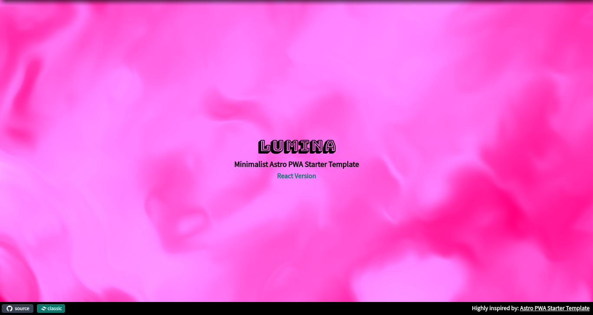

# LUMINA


### [Live Demo](https://lumina-sigma.vercel.app/)

## Alternate Themes

### Tranquiluxe (UVCanvas, Animated with this [React Library](https://uvcanvas.com/docs/components/tranquiluxe))



### [Live Demo](https://lumina-git-uvcanvas-jamerrq.vercel.app/)

## About

Template for a PWA with Astro and TailwindCSS. Prettier, EsLint and VsCode
settings included.

## How to use

1. Clone the repo

```bash
git clone git@github.com:jamerrq/lumina.git my-app
cd my-app
# or
take git@github.com:jamerrq/lumina.git
```

2. Install dependencies

```bash
pnpm install
```

3. Start the dev server (use --host to make it available on your local network)

```bash
pnpm dev
```

4. Build for production or preview

```bash
pnpm build
pnpm preview
```

---

Generated from
[`astro-pwa-starter`](https://github.com/shaunchander/astro-pwa-starter)
